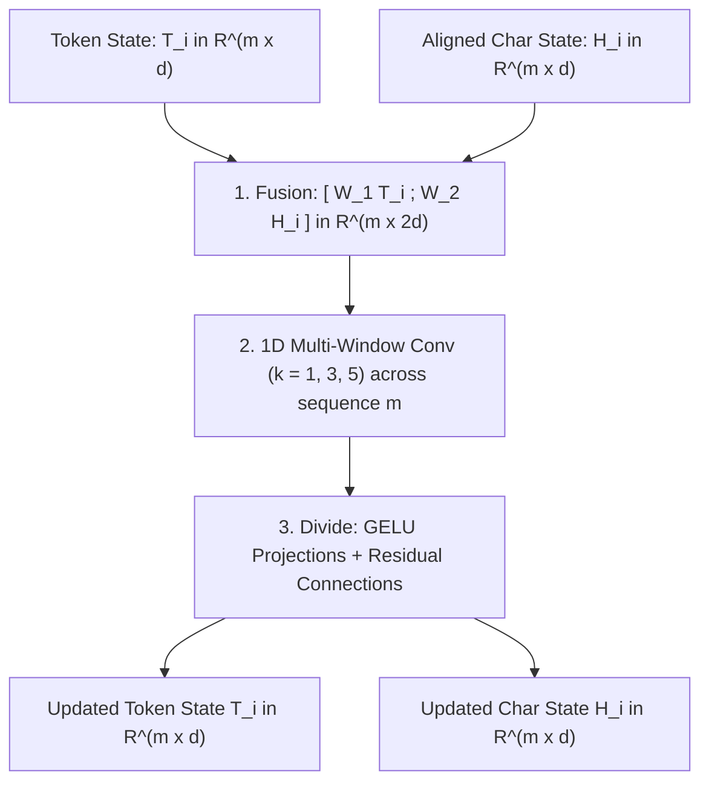

# Sequence Alignment & Boundary Pooling in Sinhala-CharBERT

## 1. Architectural Motivation & Problem Statement

In **Sinhala-CharBERT**, input text is simultaneously processed at two distinct linguistic granularities:
1. **Token Channel (Subwords):** Captures high-level contextual semantics using Byte-Pair Encoding (BPE) or WordPiece tokens (sequence length $m$).
2. **Character Channel (Phonological Units / Aksharas):** Captures fine-grained phonetic and typographical properties using `sinlib` Akshara segmentation (sequence length $N$).

### The Dual-Granularity Asymmetry ($N \gg m$)

Consider the word **`"ආයුබෝවන්"`**:

| Level | Engine | Output Representation | Length |
| :--- | :--- | :--- | :--- |
| **Subword Tokenizer** | BPE / WordPiece | `['ආයු', '##බෝවන්']` | $m = 2$ |
| **Phonological Tokenizer** | `sinlib` (Akshara) | `['ආ', 'යු', 'බෝ', 'ව', 'න්']` | $N = 5$ |

In Sinhala, words consist of multiple base consonants and vowel diacritics combined into Aksharas. As a result, the phonological sequence length $N$ is typically **2x to 4x longer** than the subword sequence length $m$.

```
Input Sentence: "ආයුබෝවන්"

Subwords (m=2):            [  w_0: "ආයු"  ]             [    w_1: "බෝවන්"    ]
                                  │                                   │
Phonological Units (N=5):  [ c_0: "ආ" , c_1: "යු" ]     [ c_2: "බෝ" , c_3: "ව" , c_4: "න්" ]
                             ▲             ▲              ▲                     ▲
Boundary Indices:       start=0         end=1          start=2               end=4
```

---

## 2. Tensor Dimension Conflict

* The **Character Bi-GRU** contextualizes the entire $N$-length sequence, producing hidden representations $\mathbf{H}_{\text{raw}} \in \mathbb{R}^{N \times d}$.
* The **Transformer Encoder** layers process the $m$-length subword sequence, maintaining state $\mathbf{T} \in \mathbb{R}^{m \times d}$.

Because sequence lengths $N$ and $m$ do not match, we cannot directly apply linear projections, tensor concatenations, or 1D multi-window convolutions between $\mathbf{T}$ and $\mathbf{H}_{\text{raw}}$.

---

## 3. Boundary Pooling Formulation

The **Sequence Alignment Engine** resolves this asymmetry by mapping every subword token $w_i$ ($i \in [1, m]$) to the exact span of its constituent phonological units:
$$\text{span}(w_i) = [\text{start\_char\_idx}[i], \text{end\_char\_idx}[i]]$$

For each subword $w_i$, the token-aligned character embedding $h_i(x)$ is computed by concatenating the **forward hidden state** of the boundary start unit with the **backward hidden state** of the boundary end unit:

$$h_i(x) = \left[ \vec{h}_{\text{start\_char\_idx}[i]}(x) \;;\; \overleftarrow{h}_{\text{end\_char\_idx}[i]}(x) \right] \in \mathbb{R}^d$$

### Why Boundary Concatenation Works
* **Forward State $\vec{h}_{\text{start}}$:** Captures the full preceding linguistic and phonological context leading into the beginning of the subword token.
* **Backward State $\overleftarrow{h}_{\text{end}}$:** Captures the full succeeding context following the end of the subword token.
* **Span Summary:** Together, the boundary pair compactly represents the phonetic structure of the entire subword span without requiring arbitrary average or max pooling.

This operation dynamically pools the $N$-length character representation into an aligned $m$-length tensor:
$$\mathbf{H}_{\text{aligned}} \in \mathbb{R}^{m \times d}$$

---

## 4. Interaction with the Heterogeneous Interaction (HI) Module

Once $\mathbf{T} \in \mathbb{R}^{m \times d}$ and $\mathbf{H} \in \mathbb{R}^{m \times d}$ share the identical sequence length $m$, the **Heterogeneous Interaction (HI) Module** can execute layer-by-layer fusion at every Transformer block:



1. **Channel Fusion:** Project and concatenate along hidden axis:
   $$w_i(x) = [W_1 t_i(x) + b_1 \;;\; W_2 h_i(x) + b_2] \in \mathbb{R}^{2d}$$
2. **Multi-Window 1D Convolution:** Convolve across sequence positions $t \in [1, m]$ with kernel sizes $k \in \{1, 3, 5\}$:
   $$m_{j, t} = \tanh(W_3^j * w_{t : t+k-1} + b_3^j)$$
3. **Divide & Residual Update:**
   $$T_i(x) = \text{LayerNorm}(t_i(x) + \text{GELU}(W_4 m_i(x) + b_4))$$
   $$H_i(x) = \text{LayerNorm}(h_i(x) + \text{GELU}(W_5 m_i(x) + b_5))$$

---

## 5. Special Token Handling

| Token Type | Subword Representation | Character Channel Representation | Boundary Index Rule |
| :--- | :--- | :--- | :--- |
| `[CLS]` / `[BOS]` | Subword ID 101 | Special Char `<bos>` | $\text{start} = \text{end} = \text{idx}(\text{<bos>})$ |
| `[SEP]` / `[EOS]` | Subword ID 102 | Special Char `<eos>` | $\text{start} = \text{end} = \text{idx}(\text{<eos>})$ |
| `[PAD]` | Subword ID 0 | Special Char `<pad>` | $\text{start} = \text{end} = \text{idx}(\text{<pad>})$ |
| `[MASK]` | Subword ID 103 | Original / Corrupted Phono Units | Span of masked subword |
